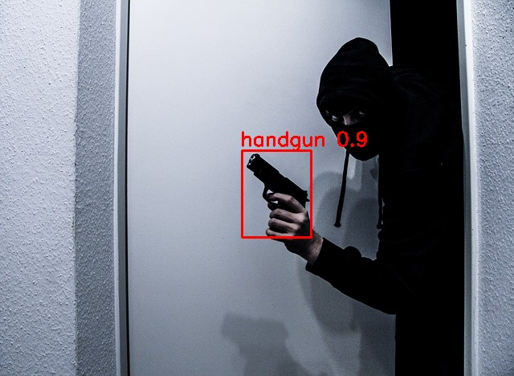
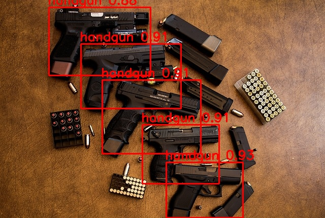

# Object Detection Demo

This is a demo project for demonstrating how to apply machine learning for object detection and create a backend to request detection of objects in images. The focus is on implementation and the steps required.

<p align="center">
  
  
</p>

As this is a demo project, multiple tools are on display to help further understanding of development in a professional setting:

- Python3 => main language used
- Pylint => maintaining a consistent code format to assist readability of files
- Pytest => creating and running unit tests to ensure reliability of changes
- Docker => providing a consistent runtime environment to simplify testing and deployment
- Flask => a lightweight web application framework, providing our endpoints
- Roboflow => computer vision development framework for dataset collection, annotation and model training
- Google Colab => running GPU intensive tasks via a web browser, for our custom training
- Ultralytics => framework for creating, training and running machine learning models
- Openvino => optimising and running machine learning models
- Tensorflow => end to end platform for machine learning, only used for sampling how to perform batching object detection for many images

## Applying Machine Learning for Obect Detection

A full desription of the choice of dataset, the annotation and training of a model can be found in [machine_learning/README.md](machine_learning/README.md)

## Service Design

After creating a model to perform object detection we must consider how to deploy it. For this we will take a generic approach and assume that this will be deployed as a micro-service allowing other services within a system to make API requests for inference on images. To do so:

- We shall utilise Docker with 2 Docker services:

  - python:3.11-bullseye => running our flask application to recieve API requests
  - openvino/model_server:2023.2 => running the inference for our object detection model/s

- Using these as seperate Docker services allows for independant scaling
- Each Docker service should be able to run multiple instances in parallel, making this highly scalable
- The Openvino Model Server provides a high performance system for serving models, reducing the optimisation work required

This design is simple, and easy to modify for multiple use cases; for example if the object detection was required for a fully automated system you may consider switching out the flask application for a queue and task worker service.

## Running Locally

- Install docker desktop on your PC
  - This was written with [Docker Desktop 4.25.1](https://www.docker.com/products/docker-desktop/)
- Open a terminal at the base of this project and run the following:

```bash
docker-compose -f ./docker/object_detection_demo/docker-compose.local.yml build
docker-compose -f ./docker/object_detection_demo/docker-compose.local.yml up
```

- Multiple requirements.txt files are used so that for production we can only install the necessary libraries, ignoring the ones used for testing.

- If you need to enter the app docker container run the following in another terminal:

```bash
docker exec -it objection_detection_demo_app_local bash
```

For cleaning up the docker containers run:

```bash
 docker-compose -f ./docker/object_detection_demo/docker-compose.local.yml down -v
```

## Running Tests

The test python scripts are prefixed with "try_" to distinguish them from the files for unit testing. The main objective of most "try_" files is to manually check some part/s of the service, for further information read the notes provided in the "try_" files.

- After having the [container up an running](#running-locally), open a new terminal and run the following:

```bash
docker exec -it objection_detection_demo_app_local python3 try_detect.py
python3 ./src/try_app_speed.py
```

- If running on windows you may need to call the second command as `python ./src/try_app_speed.py` instead

## Running Unit Tests

Unit testing is a great tool to help ensure reliability of a project as more changes are applied. Each unit test will check a specific section/function/class of your code and return if it is still running as intended. This project has applied unit testing, I have rushed this out so some parts are missing unit testing.

- After having the [container up an running](#running-locally), open a new terminal and run the following:

```bash
docker exec -it objection_detection_demo_app_local python3 -m coverage run -m pytest
docker exec -it objection_detection_demo_app_local python3 -m coverage report -i
```

- The resulting coverage report gives a good indicator of how covered your project is with unit testing. Although, this should not be taken as the only indicator of a well tested project, as the quality of the unit tests is important too. Unit testing is something that should evolve as you develop and debug.

## Python Linting

Linting is a helpful tool to check code quality, detect programming errors and offer some refactoring suggestions. Using it in this project aids the readability of the code and reduces errors, improving the overall maintainability of the project for the long term.

- To use the linting in this project install pylint onto your PC:

```bash
pip3 install pylint==3.0.2
```

- For VSCode, the [pylint extension](https://marketplace.visualstudio.com/items?itemName=ms-python.pylint) is helpful, this project was done with version v2023.10.1

- To assess all python code in the project run the linter container, open a terminal at the base of this project and run the following:

```bash
docker-compose -f ./docker/object_detection_demo/docker-compose.linter.yml build
docker-compose -f ./docker/object_detection_demo/docker-compose.linter.yml up
```

- Note we are expecting the linter container to run and exit afterwards, it should display the results.
- For an acceptable result we want:

  - A minimal amount of convention and refactor messages
  - No warnings, errors or fatal messages

## License

As [Ultralytics YoloV8](https://github.com/ultralytics/ultralytics) version 8.0.196 is used in creating the model, this project would fall under the [AGPL license](https://www.gnu.org/licenses/agpl-3.0.en.html) unless you request their [Enterprise license](https://www.ultralytics.com/license) or create the model without Ultralytics YoloV8
